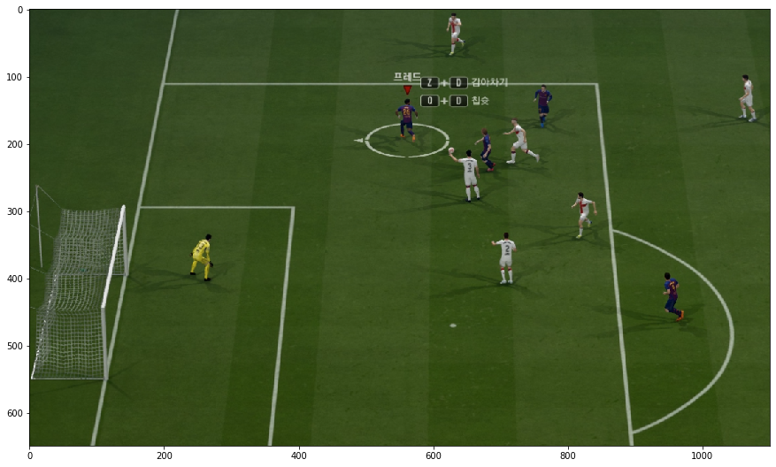
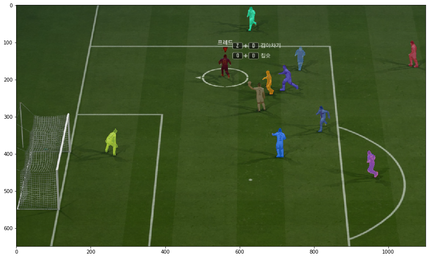

# Detailed Report
Read [Offise_detection_report.pdf](https://github.com/iced-espresso/OffsideDetection/files/9001951/Offise_detection_.pdf)

# Final Result

# Team distinction

# Line detection

# Human detection
The code and data for human detection is based on mmdetection.(https://github.com/open-mmlab/mmdetection

[Example]

